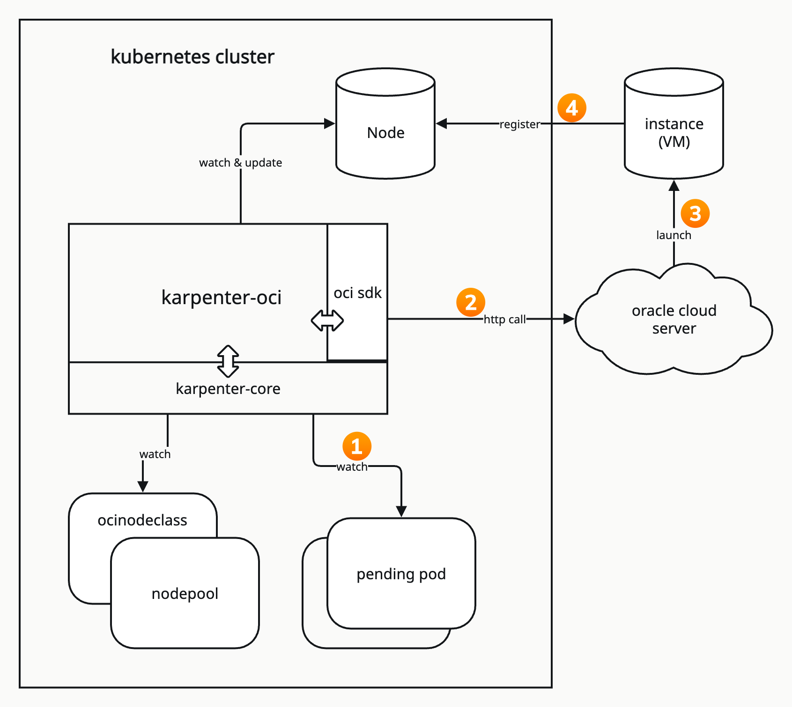

# karpenter-oci

## Description
karpenter-oci is the oracle cloud implement of karpenter, it depends on [karpenter](https://github.com/kubernetes-sigs/karpenter). It supports OKE cluster, and self-managed cluster on oracle cloud.

## Arch Overview


## Feature
1. Automatically scale up node capacity when available resources are insufficient
2. Decommission idle nodes when no workload is present
3. Support multi authenticate Method: resource principle, instance principle, api key, session
4. Image is configurable
5. Subnet is configurable
6. Supports configuration of none or multiple security groups
7. Support VM and Bare Metal
8. Support attachment of additional disk
9. Support specifying the kubelet configuration
## Installation
### prepare
1. create a compartment, karpenter-oci will launch instance in this compartment
2. create an OKE cluster under the above compartment
3. create policy in oracle console, the name could like karpenter-oke-policy, the statements as below
```
Allow any-user to manage instance-family in tenancy where all {request.principal.type = 'workload',request.principal.namespace = 'karpenter',request.principal.service_account = 'karpenter'}
Allow any-user to manage instances in tenancy where all {request.principal.type = 'workload',request.principal.namespace = 'karpenter',request.principal.service_account = 'karpenter'}
Allow any-user to read instance-images in tenancy where all {request.principal.type = 'workload',request.principal.namespace = 'karpenter',request.principal.service_account = 'karpenter'}
Allow any-user to read app-catalog-listing in tenancy where all {request.principal.type = 'workload',request.principal.namespace = 'karpenter',request.principal.service_account = 'karpenter'}
Allow any-user to manage volume-family in tenancy where all {request.principal.type = 'workload',request.principal.namespace = 'karpenter',request.principal.service_account = 'karpenter'}
Allow any-user to manage volume-attachments in tenancy where all {request.principal.type = 'workload',request.principal.namespace = 'karpenter',request.principal.service_account = 'karpenter'}
Allow any-user to use volumes in tenancy where all {request.principal.type = 'workload',request.principal.namespace = 'karpenter',request.principal.service_account = 'karpenter'}
Allow any-user to use virtual-network-family in tenancy where all {request.principal.type = 'workload',request.principal.namespace = 'karpenter',request.principal.service_account = 'karpenter'}
Allow any-user to inspect vcns in tenancy where all {request.principal.type = 'workload',request.principal.namespace = 'karpenter',request.principal.service_account = 'karpenter'}
Allow any-user to use subnets in tenancy where all {request.principal.type = 'workload',request.principal.namespace = 'karpenter',request.principal.service_account = 'karpenter'}
Allow any-user to use network-security-groups in tenancy where all {request.principal.type = 'workload',request.principal.namespace = 'karpenter',request.principal.service_account = 'karpenter'}
Allow any-user to use vnics in tenancy where all {request.principal.type = 'workload',request.principal.namespace = 'karpenter',request.principal.service_account = 'karpenter'}
Allow any-user to use tag-namespaces in tenancy where all {request.principal.type = 'workload',request.principal.namespace = 'karpenter',request.principal.service_account = 'karpenter'}
```
4. create tag namespace, the namespace name could like `oke-karpenter-ns`, the required keys show in below sheet, if you want to attach more customer tags, you also can add them in the namespace.

| key                              | description                                  |
|:---------------------------------|:---------------------------------------------|
| karpenter_k8s_oracle/ocinodeclass| the name of nodeclass used to crate instance |
| karpenter_sh/managed-by          | the OKE cluster name                         |
| karpenter_sh/nodepool            | the name of nodepool used to create instance |

### install
replace the clusterName, clusterEndpoint, clusterDns, compartmentId, ociResourcePrincipalRegion with yours.
```
kubectl apply -f ./pkg/apis/crds/
helm upgrade --install karpenter ./charts/karpenter --namespace "karpenter" --create-namespace --set "settings.clusterName=karpenter-oci-test" --set "settings.clusterEndpoint=https://10.0.0.8:6443" --set "settings.clusterDns=10.96.5.5" --set "settings.compartmentId=ocid1.compartment.oc1..aaaaaaaa" --set "settings.ociResourcePrincipalRegion=us-ashburn-1"
```
setting details

| setting                    | description                                                                                                                                | default                      |
|----------------------------|--------------------------------------------------------------------------------------------------------------------------------------------|------------------------------|
| clusterName                | cluster name                                                                                                                               |                              |
| clusterEndpoint            | api server private endpoint                                                                                                                |                              |
| clusterDns                 | IP addresses for the cluster DNS server, general is core dns ip                                                                            |                              |
| compartmentId              | the compartment id or your worker nodes                                                                                                    |                              |
| ociResourcePrincipalRegion | the region your cluster belong to, refer [issue](https://github.com/oracle/oci-go-sdk/issues/489                                           |                              |
| ociAuthMethods             | API_KEY, OKE, SESSION, INSTANCE_PRINCIPAL                                                                                                  | OKE                          |
| flexCpuConstrainList       | to constrain the ocpu cores of flex instance, instance create in this cpu size list, ocpu is twice of vcpu                                 | "1,2,4,8,16,32,48,64,96,128" |
| flexCpuMemRatios           | the ratios of vcpu and mem, eg. FLEX_CPU_MEM_RATIOS=2,4, if create flex instance with 2 cores(1 ocpu), mem should be 4Gi or 8Gi            | "2,4,8"                      |
| tagNamespace               | The tag namespace used to create and list instances by karpenter-oci, karpenter-oci will attach nodepool and nodeclass tag on the instance | oke-karpenter-ns             |
| vmMemoryOverheadPercent    | he VM memory overhead as a percent that will be subtracted from the total memory for all instance types                                    | 0.075                        |
## Usage
### nodepool
nodepool use to specify the disruption strategy, cpu and memory limits and requirements. The oracle feature requirement include the below labels:

| label                                    | description                                                                                                           | example             |
|------------------------------------------|-----------------------------------------------------------------------------------------------------------------------|---------------------|
| karpenter.k8s.oracle/instance-shape-name | the shape name                                                                                                        | VM.Standard.E4.Flex |
| karpenter.k8s.oracle/instance-cpu        | the vcpu count of the instance shape, for flex shape, karpenter-oci will strictly create instance in these vcpu sizes | 4,8                 |
| karpenter.k8s.oracle/instance-memory     | the memory size of the instance shape, the unit is MB                                                                 | 2048,4096           |
| karpenter.k8s.oracle/instance-gpu        | the gpu card count of the instance shape                                                                              | 1                   |
| karpenter.k8s.oracle/is-flexible         | the instance shape is flexible or not                                                                                 | "true"              |

[example](pkg/apis/crd/sample/nodepool_sample.yaml)
```yaml
apiVersion: karpenter.sh/v1
kind: NodePool
metadata:
  name: karpenter-test
spec:
  disruption:
    budgets:
      - nodes: 10%
    consolidateAfter: 30m0s
    consolidationPolicy: WhenEmpty
  limits:
    cpu: 64
    memory: 300Gi
  template:
    metadata:
      labels:
        servicegroup: karpenter-test
    spec:
      expireAfter: Never
      nodeClassRef:
        group: karpenter.k8s.oracle
        kind: OciNodeClass
        name: karpenter-test
      requirements:
        - key: karpenter.sh/capacity-type
          operator: In
          values:
            - on-demand
        - key: karpenter.k8s.oracle/instance-shape-name
          operator: In
          values:
            - VM.Standard.E4.Flex
        - key: karpenter.k8s.oracle/instance-cpu
          operator: In
          values:
            - '4'
            - '8'
            - '16'
        - key: kubernetes.io/os
          operator: In
          values:
            - linux
      terminationGracePeriod: 30m
```
### ocinodeclass
the ocinodeclass is used for config the oracle cloud related resource, like OS image, subnet, security group, and also kubelet config.

| spec                           | description                                                                                                                | required | example                                                                                                              |
|--------------------------------|----------------------------------------------------------------------------------------------------------------------------|----------|----------------------------------------------------------------------------------------------------------------------|
| bootConfig.bootVolumeSizeInGBs | The size of the boot volume in GBs. Minimum value is 50 GB and maximum value is 32,768 GB (32 TB).                         | yes      | 100                                                                                                                  |
| bootConfig.bootVolumeVpusPerGB | The number of volume performance units (VPUs) that will be applied to this volume per GB                                   | yes      | 10                                                                                                                   |
| image.compartmentId            | the compartment id of the image                                                                                            | yes      | ocid1.compartment.oc1..aaaaaaaab4u67dhgtj5gpdpp3z42xqqsdnufxkatoild46u3hb67vzojfmzq                                  |
| image.name                     | the image name                                                                                                             | yes      | Oracle-Linux-8.10-2025.02.28-0-OKE-1.30.1-760                                                                        |
| launchOptions                  | LaunchOptions Options for tuning the compatibility and performance of VM shapes                                            | no       | [detail](https://docs.oracle.com/en-us/iaas/tools/python/2.150.3/api/core/models/oci.core.models.LaunchOptions.html) |
| blockDevices                   | The details of the volume to create for CreateVolume operation.                                                            | no       | `sizeInGBs: 100` `vpusPerGB: 10`                                                                                     |
| imageFamily                    | support OracleOKELinux and Ubuntu2204, for OKE cluster use `OracleOKELinux` and for self-managed cluster use `Ubuntu2204`  | yes      | OracleOKELinux                                                                                                       |
| vcnId                          | the vcnId of the cluster                                                                                                   | yes      |                                                                                                                      |
| subnetName                     | the name of the subnet which you want to create the worker nodes instance in                                               | yes      | oke-nodesubnet-quick-test                                                                                            |
| securityGroupNames             | the security groups you want to attach to the instance                                                                     | no       |                                                                                                                      |
| tags                           | the tags you want to attach to the instance                                                                                | no       |                                                                                                                      |
| metaData                       | specify for native cni cluster                                                                                             | no       | `{"oke-native-pod-networking":"true"}`                                                                               |
| userData                       | customer userdata you want to run in the cloud-init script, it will execute before the kubelet start                       | no       |                                                                                                                      |
| kubelet                        | customer kubelet config                                                                                                    | no       | [KubeletConfiguration](pkg/apis/v1alpha1/ocinodeclass.go)                                                            |

- if your cluster use flannel as the cni, you can refer:
[example](pkg/apis/crd/sample/oke_ocinodeclasses_sample.yaml)
```yaml
apiVersion: karpenter.k8s.oracle/v1alpha1
kind: OciNodeClass
metadata:
  name: karpenter-test
spec:
  bootConfig:
    bootVolumeSizeInGBs: 100
    bootVolumeVpusPerGB: 10
  image:
    compartmentId: ocid1.compartment.oc1..aaaaaaaab4u67dhgtj5gpdpp3z42xqqsdnufxkatoild46u3hb67vzojfmzq
    name: Oracle-Linux-8.10-2025.02.28-0-OKE-1.30.1-760
  imageFamily: OracleOKELinux
  kubelet:
    evictionHard:
      imagefs.available: 15%
      imagefs.inodesFree: 10%
      memory.available: 750Mi
      nodefs.available: 10%
      nodefs.inodesFree: 5%
    systemReserved:
      memory: 100Mi
  subnetName: {{ .subnetName }}
  vcnId: {{ .vcnId }}
```
- if your cluster use the native cni, you should set `oke-native-pod-networking` in the metadata as `true`, you can refer: [example](pkg/apis/crd/sample/oke_ocinodeclasses_native_cni_sample.yaml)
```yaml
apiVersion: karpenter.k8s.oracle/v1alpha1
kind: OciNodeClass
metadata:
  name: karpenter-test
spec:
  bootConfig:
    bootVolumeSizeInGBs: 100
    bootVolumeVpusPerGB: 10
  image:
    compartmentId: ocid1.compartment.oc1..aaaaaaaab4u67dhgtj5gpdpp3z42xqqsdnufxkatoild46u3hb67vzojfmzq
    name: Oracle-Linux-8.10-2025.02.28-0-OKE-1.30.1-760
  imageFamily: OracleOKELinux
  metaData:
    oke-native-pod-networking: "true"
  kubelet:
    evictionHard:
      imagefs.available: 15%
      imagefs.inodesFree: 10%
      memory.available: 750Mi
      nodefs.available: 10%
      nodefs.inodesFree: 5%
    systemReserved:
      memory: 100Mi
  subnetName: {{ .subnetName }}
  vcnId: {{ .vcnId }}
```

## Support
If you meet any problem, welcome to raise a issue.
## Roadmap
| item                          | date      |
|-------------------------------|-----------|
| update karpenter core to v1.4 | 2024.June |
## Contributing
Contributing is welcome, you can raise a PR to add new feature or fix bugs. We use `envtest` to run the test suite, better add the related test case in your commit.

## License
http://www.apache.org/licenses/LICENSE-2.0